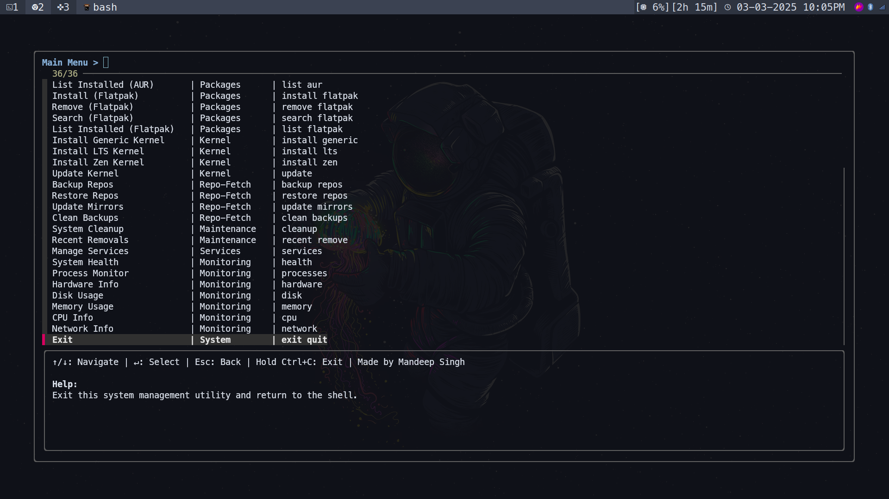
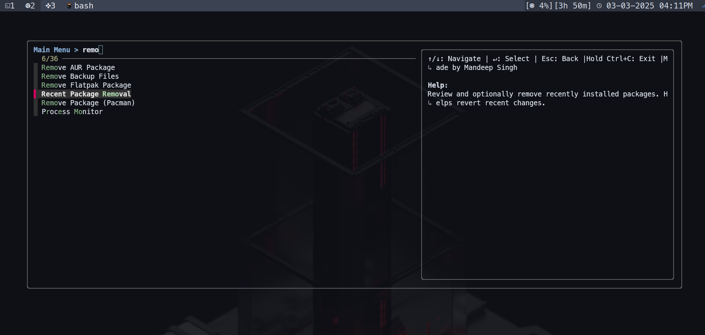

# ArchManagement

A simple script to manage Arch Linux configurations using a terminal-based UI.


## Preview

### Main UI  
  

### Application in Action  
  

## Installation

Run the following commands to install:

```bash
chmod +x install.sh
./install.sh
